<!-- # book-thing.io

Initial wireframes:

https://wireframe.cc/x0a8I9

https://wireframe.cc/6oVXTU -->
# Marvelous Bookworm

A web-application that allows users to create collections of their favorite Marvel Comics characters. Lists will present information in cards that give information about the character, if available, and a collection of links for the character's series that allow the user to potentially buy them.

## Motivation

I like comic books and the Marvel Cinematic Universe. I thought a tool that would help people see where certain characters came from and how they've developed would be useful for newcomers to these characters and comic-lovers alike.


## Screenshots
Login Screen/Landing Page:

Fullscreen: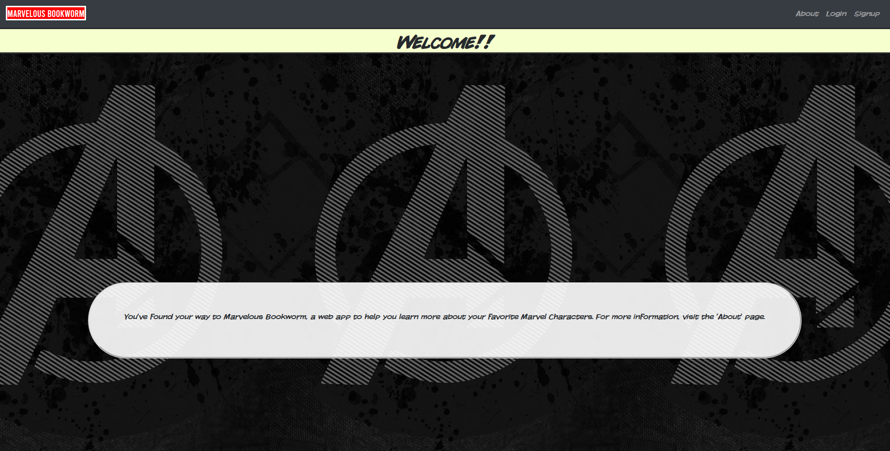

Mobile: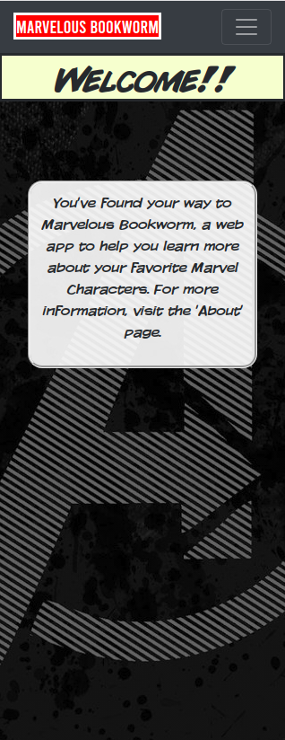


About Page:

Fullscreen: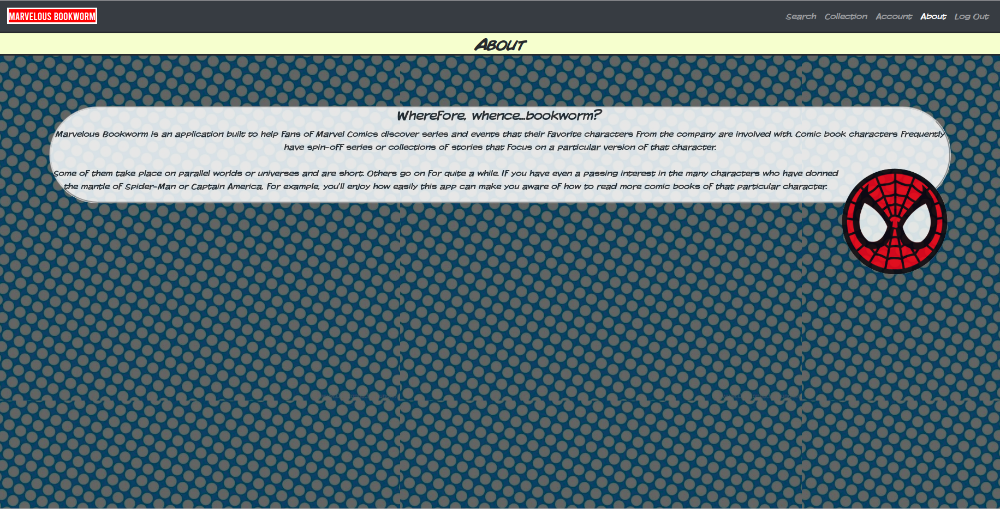

Mobile: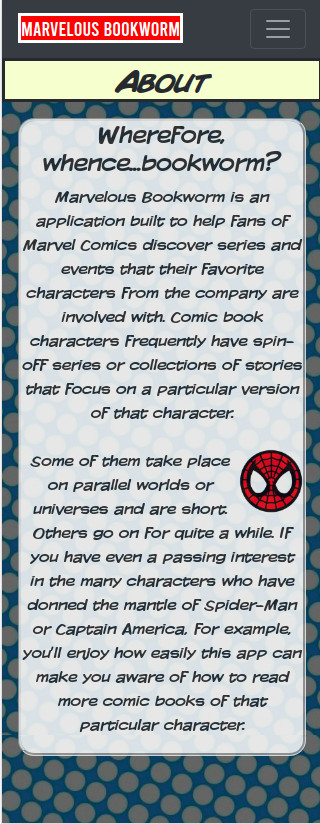

Signup Page 

Fullscreen: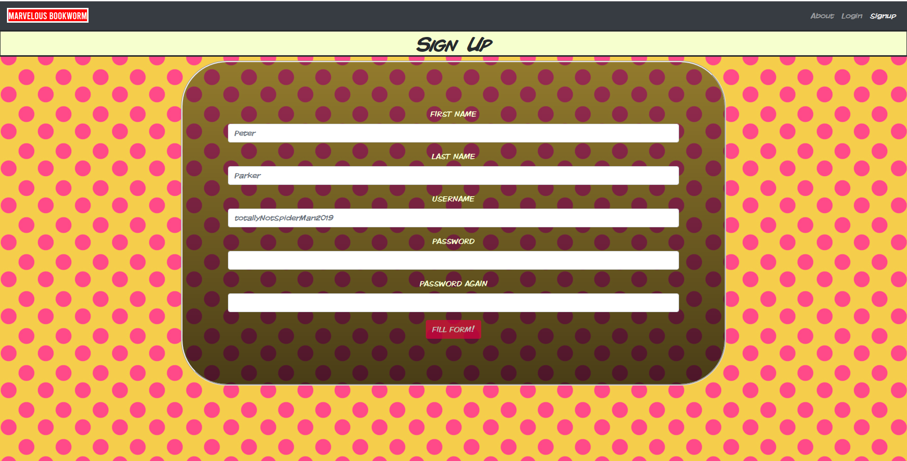
Mobile: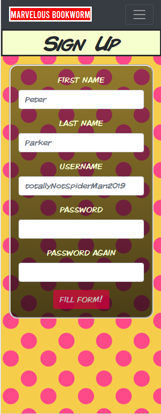

Search Page

Fullscreen: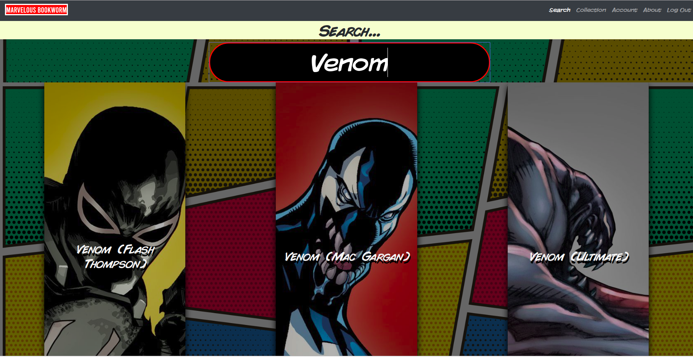
Mobile: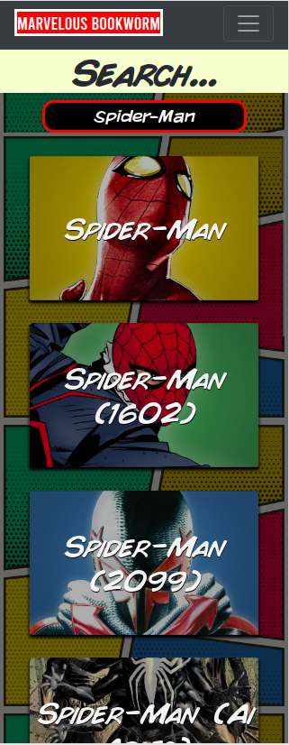

Collection Page

Fullscreen:
Mobile: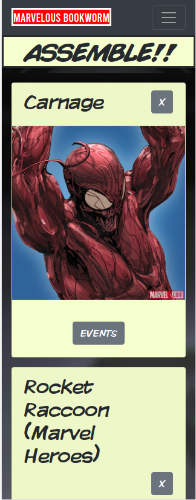

Collection with Modal

Fullscreen: 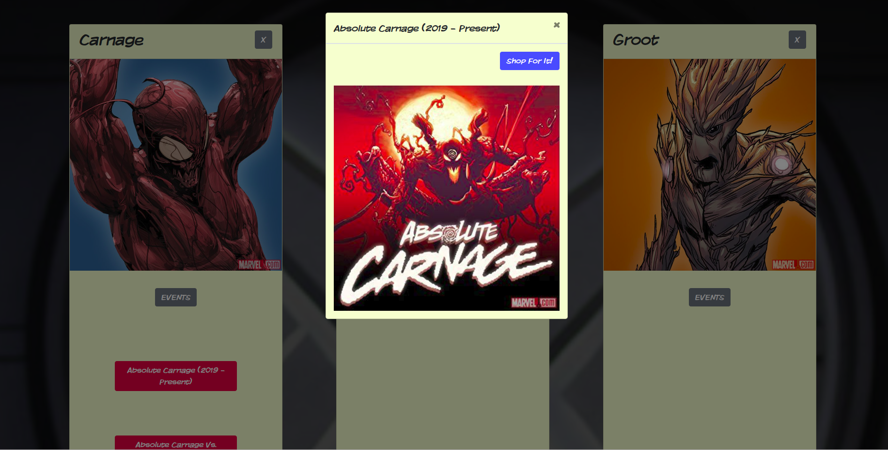
Mobile: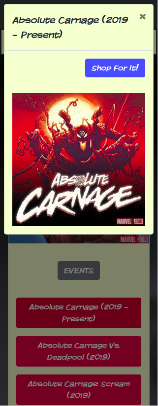

Account Page
Fullscreen: 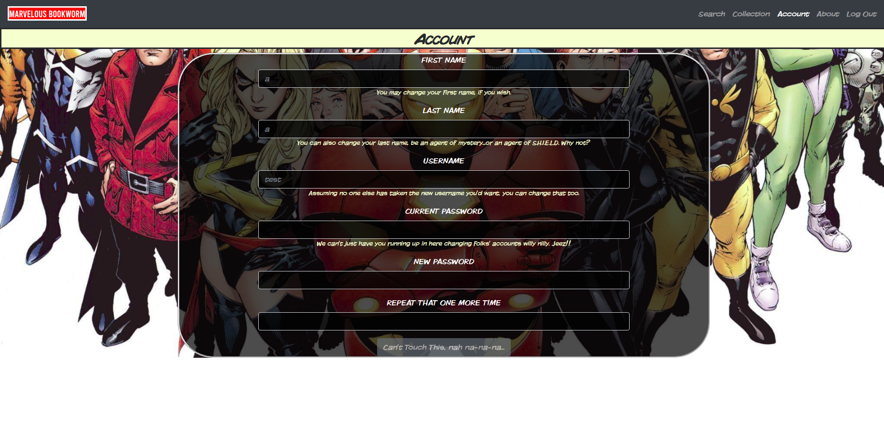
Mobile: 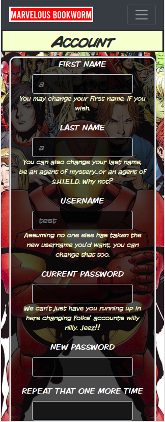


<!-- About:


Library:


Recommendations:

 -->

## Environment Setup

1. You'll need to clone <INSERT LINK> and run 
```
npm install
```
then
```
npm start
```

2. Do the same for this package.

3. Open up a window at localhost:8000


## Running the tests

To run all tests, run
```
npm test
```

## Built With

### Front-End
* React
* Redux
* React-Router
* Sass/SCSS

### Back-End
* MongoDB
* Express
* Node

### Testing
* Mocha
* Chai
* Chai-http
* Jest
* Enzyme

## Features

* Create a list of characters
* See comic book series belonging to the characters you've chosen
* Use links to potentially buy series you're interested in

## Running Project Link

- [Live](https://infinite-journey-91193.herokuapp.com/)

## Authors

* **Adrian Rosales** - ** - Fullstack Web Development


## Acknowledgments

* **Starline** - ** - For the use of their art for the 'Search' page.
- [Art](https://www.freepik.com/free-photos-vectors/background")